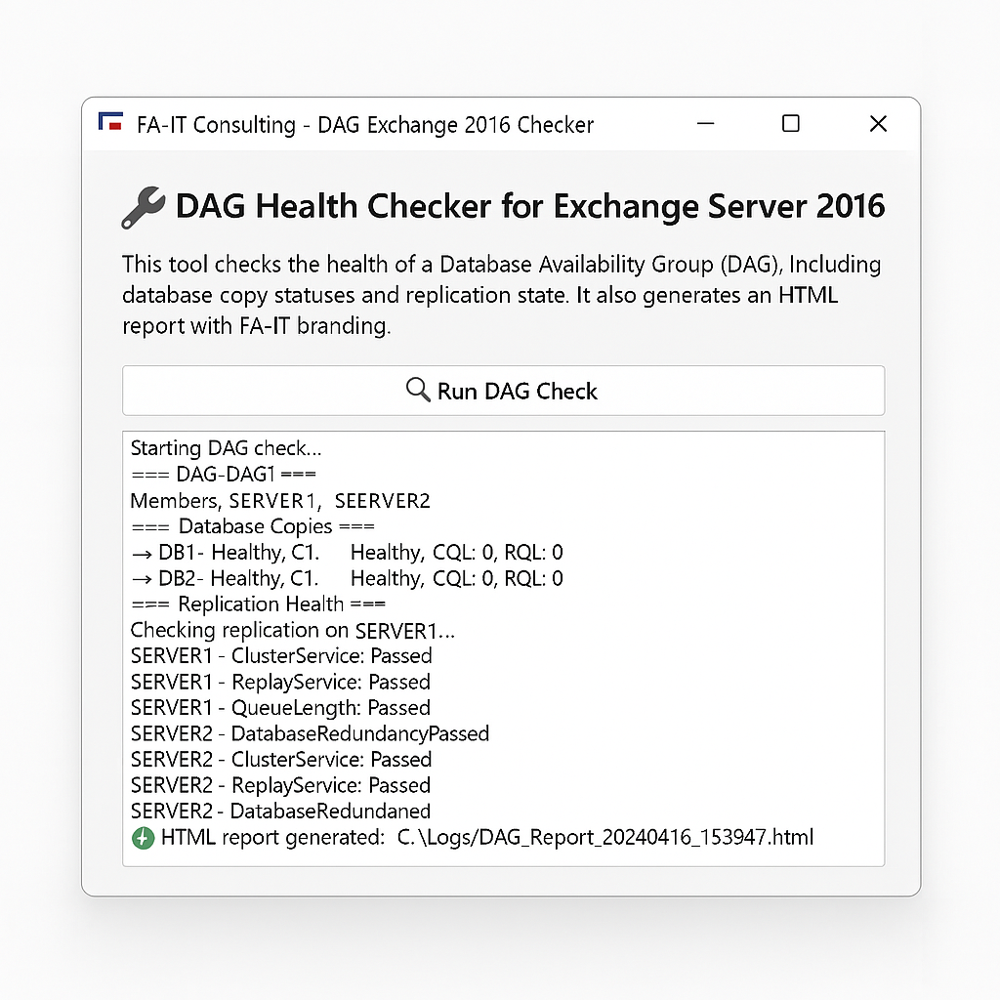

# DAG Exchange 2016 Checker GUI - FA-IT Consulting

## ✨ Description
This PowerShell project provides a GUI for checking the state of a DAG (Database Availability Group) in Exchange Server 2016. It enables:

- Display of DAG members
- Listing of database copies and their statuses (CopyQueueLength, ReplayQueueLength, ContentIndexState)
- Testing replication health with `Test-ReplicationHealth`
- Auto-generating a detailed HTML report for documentation or auditing purposes

> Created by FA-IT Consulting for simplifying Exchange monitoring and health validation.

---

## 🚀 Launch

1. Open a PowerShell session as Administrator.
2. Run the main script:

```powershell
.\Check-DAG-GUI.ps1
```

3. The interface will open. Click “Run Check” to start.

---

## 📃 HTML Report

- An HTML report will be generated in `C:\Logs\DAG_Report_yyyyMMdd_HHmmss.html`.
- It includes DAG members, copies, and replication health.
- You can convert it to PDF with [wkhtmltopdf](https://wkhtmltopdf.org/).

---

## ⚖️ Prerequisites

- PowerShell 5.1+
- Exchange Admin rights
- Exchange Management Shell access
- A `C:\Logs` folder created if it doesn’t exist

---

## 🌐 HTML → PDF Conversion (optional)

If wkhtmltopdf is installed:

```powershell
& "C:\Program Files\wkhtmltopdf\bin\wkhtmltopdf.exe" "C:\Logs\DAG_Report_*.html" "C:\Logs\DAG_Report.pdf"
```

---

## 💡 Tips

- You can modify the title or add your own logo in the HTML `<head>`.
- Can be integrated into RMM/NOC internal solutions.

---

## 🌍 Useful Links

- [Exchange DAG Documentation](https://learn.microsoft.com/en-us/exchange/high-availability/database-availability-groups/database-availability-groups?view=exchserver-2016)
- [FA-IT Consulting on LinkedIn](https://www.linkedin.com/company/fa-it-consulting/)

---

## © FA-IT Consulting 2025

Commercial redistribution without permission is prohibited.
